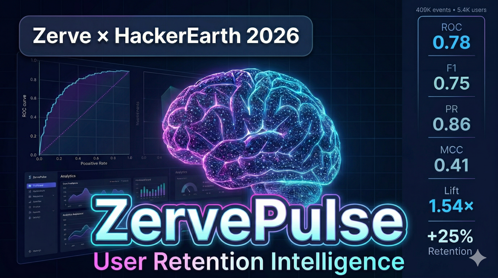

<div align="center">

# ⚡ ZervePulse — User Retention Intelligence System

**AI-native churn prediction and retention intelligence platform built entirely inside Zerve.**  
Zerve × HackerEarth Data Challenge 2026

[](LICENSE)
[](https://www.python.org/)
[](https://zervepulse.hub.zerve.cloud)

</div>

---

## 📂 Repository Structure

```
zervepulse/
├── code/
│   ├── pipelines/         # Data processing and optimization
│   ├── features/          # 23-feature engineering pipeline
│   ├── evaluation/        # 22-metric evaluation framework
│   ├── segmentation/      # Persona segmentation + BI report
│   ├── deployment/        # Streamlit dashboard deployment
|   ├── model/             # Churn Model
├── data/
│   ├── raw/               # Dataset instructions
│   └── processed/         # Engineered feature tables
├── models/                # Trained model artifacts
├── results/               # All visualization outputs
├── reports/               # Business intelligence reports
├── docs/                  # Methodology and system design
├── assets/                # Project assets
└── LICENSE
```

---

## 🎬 Video Demo

Watch the published demo on YouTube:

[YouTube Demo Video](https://youtu.be/BLEFkihgGqQ)

<div align="center">
  <a href="https://youtu.be/BLEFkihgGqQ" target="_blank">
    
  </a>
  <br/>
  <em>Click the image above to watch the full demo video on YouTube.</em>
</div>

---
## 📝 Prompt Documentation

Full prompts, reasoning, and outputs for every analysis step: [docs/prompts_documentation.md](docs/prompts_documentation.md)

---

## 📥 Raw Data & Config Files

All raw data and configuration files are available in the `zervepulse_canvas` branch of the official GitHub repository:

[Access raw files and configs (zervepulse_canvas branch)](https://github.com/niloydebbarma-code/zervepulse/tree/zervepulse_canvas)

---

## Overview

ZervePulse is a production-grade user retention intelligence system that transforms raw platform behavioral events into actionable churn predictions, user persona segmentation, and strategic retention recommendations — deployed as a live interactive dashboard.

**Every line of code was written by the Zerve AI agent. Zero external tools. Zero manual coding. Fully reproducible.**

---

## Live Demo

| Resource | Link |
|---|---|
| Live Dashboard | https://zervepulse.hub.zerve.cloud |
| ZervePulse Canvas | https://app.zerve.ai/notebook/a15ae300-6a9d-4609-a160-72fb0da3f594 |
| Zerve Gallery (Project) | https://www.zerve.ai/gallery/a15ae300-6a9d-4609-a160-72fb0da3f594 |
| LinkedIn Post | https://www.linkedin.com/posts/niloydebbarmacpscr_zervepulse-user-retention-intelligence-activity-7443471084475092992-ObVI |
| HackerEarth Challenge | https://zerve2026.hackerearth.com |

---

## Dataset

| Property | Value |
|---|---|
| Total events | 409,287 |
| Unique users | 5,410 |
| Unique event types | 141 |
| Columns | 107 (raw) → 18 (optimized) |
| Source | Zerve × HackerEarth Data Challenge 2026 |

**Dataset not included in this repository.** See [data/raw/README.md](data/raw/README.md) for download instructions.

---

## System Architecture

```
Raw Events (409,287 rows)
        │
        ▼
Data Processing Pipeline
(dtype optimization, null handling, canvas ID extraction)
        │
        ▼
Feature Engineering
(23 custom behavioral features per user)
        │
        ▼
4-Model Competition
(GradientBoosting · HistGradientBoosting · RandomForest · LogisticRegression)
        │
        ▼
HistGradientBoosting Selected (best_model.pkl)
        │
        ▼
22-Metric Evaluation Framework
        │
        ▼
5-Persona Segmentation (ANOVA validated)
        │
        ▼
Business Intelligence Report + 6 Recommendations
        │
        ▼
Live Interactive Dashboard (Streamlit on Zerve)
```

---

## Model Performance

| Metric | Value |
|---|---|
| ROC-AUC | **0.7814** |
| PR-AUC | **0.8622** |
| F1 Score | **0.7490** |
| MCC | **0.4136** |
| Brier Score | **0.1865** |
| Decile Lift | **1.54×** |
| Precision | 0.8351 |
| Recall | 0.6790 |
| Accuracy | 0.7052 |
| Cohen's Kappa | 0.4009 |

---

## 23 Custom Behavioral Features

| # | Feature | Description |
|---|---|---|
| 1 | total_events | Count of all events per user |
| 2 | agent_usage_count | Events starting with agent_ |
| 3 | ai_adoption_index | agent_usage / total_events |
| 4 | days_active | Unique active calendar days |
| 5 | session_count | Unique browser sessions |
| 6 | session_depth_score | Events per session |
| 7 | unique_event_types | Distinct event names used |
| 8 | onboarding_complete | Completed onboarding tour |
| 9 | has_used_agent | Binary agent usage flag |
| 10 | has_deployed | Deployment event exists |
| 11 | is_python_user | Python SDK user flag |
| 12 | total_credits_used | Sum of credits consumed |
| 13 | unique_canvases | Distinct canvas projects |
| 14 | first_event_date | Earliest activity timestamp |
| 15 | last_event_date | Latest activity timestamp |
| 16 | observation_days | Active lifespan in days |
| 17 | time_to_first_agent_minutes | Minutes to first AI use |
| 18 | feature_breadth_score | Platform exploration ratio |
| 19 | churn_velocity | Activity decline rate |
| 20 | tool_diversity_count | Unique AI tools used |
| 21 | avg_credit_per_transaction | Credit intensity per action |
| 22 | python_sdk_share | API usage proportion |
| 23 | churn_label | Target — churned (1) or retained (0) |

---

## 22-Metric Evaluation Framework

### Model Performance (10 metrics)
Accuracy · Precision · Recall · F1 · ROC-AUC · PR-AUC · MCC · Cohen's Kappa · Brier Score · Decile Lift

### Advanced Research Metrics (4 metrics)
Cumulative Gain Chart · SHAP Values · Confusion Matrix · Top-10% Lift

### Custom ZervePulse Behavioral Metrics (4 metrics)
AI Adoption Index Analysis · Churn Velocity Distribution · Session Depth vs Retention · Feature Breadth vs Churn

### SaaS Business Metrics (4 metrics)
Day 1/7/30 Retention Curve · DAU/MAU Stickiness Ratio · Estimated CLV by Persona · Revenue Saved Estimate

---

## Key Findings

### Finding 1 — Canvas Creation is the #1 Retention Lever
`unique_canvases` is the strongest churn predictor (SHAP: 0.1322). Users who create multiple canvases almost never leave the platform.

### Finding 2 — AI Agent Adoption Gap
Users who adopted the AI agent churn at **52.0%** vs **77.1%** for non-adopters — a **25.1 percentage point differential** representing the single most actionable retention lever.

### Finding 3 — Critical Onboarding Gap
Only **4.25%** of users completed onboarding. Users who completed it churn at a meaningfully lower rate. This is Zerve's biggest product opportunity.

### Finding 4 — Five Statistically Validated Personas
ANOVA validation: F-statistic = 1,392, p < 0.0001

| Persona | Count | Churn Rate |
|---|---|---|
| Champion | 22 (0.4%) | 4.5% |
| Explorer | 217 (4.0%) | 87.6% |
| At-Risk | 2,159 (39.9%) | 87.5% |
| Ghost | 1,860 (34.4%) | 55.7% |
| Casual | 1,152 (21.3%) | 33.8% |

### Finding 5 — Revenue Impact
1,625 high-risk users identified. A 20% intervention success rate recovers an estimated 432 users from churn.

---

## 6 Product Recommendations

| # | Recommendation | Finding | Expected Impact |
|---|---|---|---|
| 1 | Second canvas prompt within 48 hours | unique_canvases SHAP 0.1322 | Highest-leverage single action |
| 2 | Auto-trigger AI agent in first session | 77.1% vs 52% churn gap | 25pp churn reduction |
| 3 | Redesign onboarding to 3 steps max | 4.25% completion rate | +541 users per 10% improvement |
| 4 | At-Risk re-engagement email at 7 days | 2,159 users at risk | 20% = 432 users saved |
| 5 | Ghost activation — one-click canvas | 1,860 ghost users | 5% = 93 users recovered |
| 6 | Champion recognition program | 4.5% churn, highest CLV | LTV protection + referral channel |

---

## Zerve Platform Usage

This project demonstrates Zerve's full capability stack:

- **Built-in Data Processing Pipeline** — dtype optimization, memory reduction
- **AI Agent** — wrote all Python code from plain English prompts
- **AI Agent Autonomy** — agent suggested HistGradientBoosting based on dataset characteristics
- **Deployment** — one-click Streamlit app deployment at `zervepulse.hub.zerve.cloud`
- **Reproducibility** — entire pipeline reproducible from a single canvas

---

## Tech Stack

| Component | Technology |
|---|---|
| Platform | Zerve AI-native notebook |
| Language | Python 3.12 |
| ML Model | HistGradientBoosting (scikit-learn) |
| Explainability | SHAP permutation importance |
| Imbalance handling | SMOTE (imbalanced-learn) |
| Dashboard | Streamlit |
| Visualization | Plotly, Matplotlib |
| Data processing | Pandas, NumPy |

---

## Competition Details

**Zerve × HackerEarth Data Challenge 2026**
- Prize pool: $10,000
- Submission deadline: March 30, 2026
- Challenge: What drives successful usage of a data platform?

---

## Author

**Niloy Deb Barma**

LinkedIn: https://www.linkedin.com/in/niloydebbarmacpscr

---

## License

MIT License — see [LICENSE](LICENSE) for details.
